# SynapseAnime Web Frontend — UML 2.5 Design Documentation

> Full UML 2.5 specification for the Next.js web frontend, mirroring all mobile app features with a fully responsive layout.

**Stack:** Next.js 16 · React 19 · Tailwind CSS v4 · TypeScript  
**Backend:** NestJS API on port 3005 · WebSocket (Socket.IO) for real-time  
**Target:** Responsive (mobile-first → desktop)

---

## Table of Contents

1. [Use Case Diagram](#1-use-case-diagram)
2. [Class Diagram](#2-class-diagram)
3. [Component Diagram](#3-component-diagram)
4. [Sequence Diagrams](#4-sequence-diagrams)
5. [Activity Diagrams](#5-activity-diagrams)
6. [State Machine Diagrams](#6-state-machine-diagrams)
7. [Deployment Diagram](#7-deployment-diagram)

---

## 1. Use Case Diagram

### 1.1 Actors

| Actor | Description |
|-------|-------------|
| **Guest** | Unauthenticated visitor. Can browse, search, view details and news. |
| **User** | Authenticated user. Full access to streaming, reading, downloads, AI, profile. |
| **Admin** | Manages ads and news content. |
| **Backend API** | NestJS server providing REST endpoints. |
| **WebSocket** | Socket.IO server for real-time download progress and history updates. |
| **External APIs** | Jikan, MangaDex, TMDB, Perplexity, Firebase, Stripe. |

### 1.2 Use Cases by Domain


```mermaid
graph LR
    subgraph Actors
        G((Guest))
        U((User))
        A((Admin))
    end

    subgraph Authentication
        UC_LOGIN[Login with Email]
        UC_REGISTER[Register]
        UC_GOOGLE[Login with Google]
        UC_LOGOUT[Logout]
        UC_PROFILE_VIEW[View Profile]
    end

    subgraph Anime
        UC_BROWSE_ANIME[Browse Anime Catalog]
        UC_SEARCH_ANIME[Search Anime]
        UC_ANIME_DETAIL[View Anime Details]
        UC_STREAM[Stream Episode]
        UC_TRACK_PROGRESS[Track Watch Progress]
        UC_CONTINUE[Continue Watching]
        UC_SWITCH_SOURCE[Switch Anime Source]
        UC_CALENDAR[View Airing Schedule]
    end

    subgraph Manga
        UC_BROWSE_MANGA[Browse Manga Catalog]
        UC_SEARCH_MANGA[Search Manga]
        UC_MANGA_DETAIL[View Manga Details]
        UC_READ[Read Chapter]
        UC_READING_MODE[Select Reading Mode]
    end

    subgraph MoviesTv[Movies & TV]
        UC_BROWSE_MOVIES[Browse Movies/TV]
        UC_SEARCH_MOVIES[Search Movies/TV]
        UC_MOVIE_DETAIL[View Movie/TV Details]
        UC_STREAM_MOVIE[Stream Movie/TV Episode]
    end

    subgraph UserFeatures[User Features]
        UC_WATCHLIST[Manage Watchlist]
        UC_HISTORY[View Watch History]
        UC_EDIT_PROFILE[Edit Profile]
        UC_PREFERENCES[Edit Preferences]
        UC_SETTINGS[Manage Settings]
        UC_NOTIF[Notification Settings]
    end

    subgraph Downloads
        UC_DL_EPISODE[Download Episode]
        UC_DL_SEASON[Download Season]
        UC_DL_QUEUE[View Download Queue]
        UC_DL_CANCEL[Cancel/Delete Download]
        UC_DL_URL[Download from URL]
    end

    subgraph AI
        UC_CHAT[AI Chat]
        UC_RECOMMEND[Get AI Recommendations]
    end

    subgraph Social
        UC_VIEW_COMMENTS[View Comments]
        UC_POST_COMMENT[Post Comment]
        UC_RATE[Rate Content]
    end

    subgraph Library[Local Library]
        UC_BROWSE_LIB[Browse Library Folders]
        UC_STREAM_LOCAL[Stream Local Video]
        UC_ORGANIZE_LIB[Organize Library]
    end

    subgraph Subscription[Subscription & Payments]
        UC_SUBSCRIBE[Subscribe to Premium]
        UC_CANCEL_SUB[Cancel Subscription]
        UC_VIEW_SUB[View Subscription Status]
    end

    subgraph Backup[Backup & Sync]
        UC_BACKUP[Sync Data to Cloud]
        UC_BACKUP_STATUS[View Backup Status]
    end

    subgraph Content[Content Management]
        UC_BROWSE_NEWS[Browse News]
        UC_MANAGE_NEWS[Create/Edit/Delete News]
        UC_MANAGE_ADS[Manage Ads]
        UC_AD_PERF[View Ad Performance]
    end

    %% Guest access
    G --> UC_LOGIN
    G --> UC_REGISTER
    G --> UC_GOOGLE
    G --> UC_BROWSE_ANIME
    G --> UC_SEARCH_ANIME
    G --> UC_ANIME_DETAIL
    G --> UC_BROWSE_MANGA
    G --> UC_SEARCH_MANGA
    G --> UC_MANGA_DETAIL
    G --> UC_BROWSE_MOVIES
    G --> UC_SEARCH_MOVIES
    G --> UC_MOVIE_DETAIL
    G --> UC_VIEW_COMMENTS
    G --> UC_BROWSE_NEWS
    G --> UC_CALENDAR

    %% User access (inherits Guest)
    U --> UC_LOGOUT
    U --> UC_PROFILE_VIEW
    U --> UC_STREAM
    U --> UC_TRACK_PROGRESS
    U --> UC_CONTINUE
    U --> UC_SWITCH_SOURCE
    U --> UC_READ
    U --> UC_READING_MODE
    U --> UC_STREAM_MOVIE
    U --> UC_WATCHLIST
    U --> UC_HISTORY
    U --> UC_EDIT_PROFILE
    U --> UC_PREFERENCES
    U --> UC_SETTINGS
    U --> UC_NOTIF
    U --> UC_DL_EPISODE
    U --> UC_DL_SEASON
    U --> UC_DL_QUEUE
    U --> UC_DL_CANCEL
    U --> UC_DL_URL
    U --> UC_CHAT
    U --> UC_RECOMMEND
    U --> UC_POST_COMMENT
    U --> UC_RATE
    U --> UC_BROWSE_LIB
    U --> UC_STREAM_LOCAL
    U --> UC_ORGANIZE_LIB
    U --> UC_SUBSCRIBE
    U --> UC_CANCEL_SUB
    U --> UC_VIEW_SUB
    U --> UC_BACKUP
    U --> UC_BACKUP_STATUS

    %% Admin access
    A --> UC_MANAGE_NEWS
    A --> UC_MANAGE_ADS
    A --> UC_AD_PERF
```

### 1.3 Use Case Specifications

#### UC_STREAM — Stream Episode
| Field | Value |
|-------|-------|
| **Primary Actor** | User |
| **Precondition** | User is authenticated; anime and episode exist |
| **Main Flow** | 1. User navigates to anime detail → 2. Selects episode → 3. System resolves stream URL from active source → 4. Video player initializes with HLS/MP4 → 5. Progress is tracked every 10s |
| **Alternate Flow** | Source unavailable → circuit breaker triggers → fallback source or error message |
| **Postcondition** | Watch progress saved; history updated via WebSocket |

#### UC_READ — Read Chapter
| Field | Value |
|-------|-------|
| **Primary Actor** | User |
| **Precondition** | User is authenticated; manga and chapter exist |
| **Main Flow** | 1. User navigates to manga detail → 2. Selects chapter → 3. System loads pages from MangaDex/MangaHook → 4. Reader renders in selected mode (vertical/horizontal/webtoon) → 5. Progress tracked |
| **Alternate Flow** | Source unavailable → try alternate source → error if all fail |
| **Postcondition** | Reading progress saved |

#### UC_DL_EPISODE — Download Episode
| Field | Value |
|-------|-------|
| **Primary Actor** | User |
| **Precondition** | User authenticated; episode stream URL resolvable |
| **Main Flow** | 1. User clicks download on episode → 2. Backend enqueues download → 3. WebSocket emits progress events → 4. UI shows real-time progress bar → 5. Completed download appears in history |
| **Postcondition** | File stored server-side; download record persisted |

---

## 2. Class Diagram

### 2.1 Domain Models (TypeScript Interfaces)


```mermaid
classDiagram
    class User {
        +string id
        +string email
        +string? nickname
        +string? avatarUrl
        +string? googleId
        +string? fcmToken
        +SubscriptionTier subscriptionTier
        +SubscriptionStatus? subscriptionStatus
        +Date? subscriptionExpiresAt
        +string[] readingList
        +UserPreference? preference
        +Date createdAt
    }

    class UserPreference {
        +string id
        +string userId
        +string[] preferredLanguages
        +string[] preferredGenres
    }

    class Anime {
        +string id
        +number? malId
        +string title
        +string? titleEnglish
        +string? titleJapanese
        +string description
        +string? synopsis
        +string? coverUrl
        +string? bannerImage
        +string? trailerUrl
        +string[] genres
        +string[] studios
        +AnimeStatus status
        +string? duration
        +string? type
        +number releaseYear
        +number rating
        +number popularity
        +number totalEpisodes
        +Date createdAt
    }

    class Episode {
        +string id
        +string animeId
        +number number
        +string title
        +number duration
        +string? thumbnail
        +string streamUrl
        +string? source
    }

    class Manga {
        +string id
        +string mangadexId
        +string title
        +Record~string,string~? altTitles
        +string description
        +string[] authors
        +string[] artists
        +string[] genres
        +string[] tags
        +MangaStatus status
        +number? year
        +string? coverImage
        +number rating
        +Date createdAt
        +Date updatedAt
    }

    class Chapter {
        +string id
        +string mangadexChapterId
        +number number
        +string? title
        +number? volume
        +number pages
        +string language
        +string? scanlationGroup
        +Date publishedAt
        +string mangaId
    }

    class Movie {
        +number id
        +string title
        +string? originalTitle
        +string? overview
        +string? posterPath
        +string? backdropPath
        +number voteAverage
        +number voteCount
        +string? releaseDate
        +number[] genreIds
        +string[] genres
        +number? runtime
        +string? tagline
        +CastMember[] cast
        +Movie[] similar
    }

    class TvShow {
        +number id
        +string name
        +string? overview
        +string? posterPath
        +string? backdropPath
        +number voteAverage
        +number numberOfSeasons
        +number numberOfEpisodes
        +string[] genres
        +string? firstAirDate
        +CastMember[] cast
        +TvShow[] similar
    }

    class TvEpisode {
        +number id
        +number episodeNumber
        +number seasonNumber
        +string name
        +string? overview
        +string? stillPath
        +number? runtime
        +number voteAverage
    }

    class CastMember {
        +string name
        +string? character
        +string? profilePath
    }

    class WatchHistory {
        +string id
        +string userId
        +string episodeId
        +number progressSeconds
        +boolean completed
        +Date watchedAt
        +Date updatedAt
    }

    class WatchlistItem {
        +string id
        +string userId
        +string? animeId
        +string? mangaId
        +Date addedAt
    }

    class ReadingHistory {
        +string id
        +string userId
        +string mangaId
        +string chapterId
        +number progress
        +Date lastReadAt
    }

    class Comment {
        +string id
        +string userId
        +string text
        +number? rating
        +string? animeId
        +string? mangaId
        +string? episodeId
        +string? parentId
        +Comment[] replies
        +Date createdAt
        +Date updatedAt
    }

    class Download {
        +string id
        +string userId
        +string animeId
        +string animeName
        +string episodeId
        +number episodeNumber
        +string? episodeTitle
        +DownloadStatus status
        +number progress
        +string? filePath
        +string? fileName
        +string? errorMessage
        +string? streamUrl
        +string? thumbnailPath
        +string? thumbnailUrl
        +string? source
        +Date createdAt
        +Date? completedAt
    }

    class DownloadSettings {
        +string id
        +string userId
        +string? downloadPath
        +boolean useServerFolder
        +string? serverFolderPath
        +Date updatedAt
    }

    class ChatMessage {
        +string id
        +string content
        +boolean isUser
        +Date timestamp
        +Anime[]? recommendations
    }

    class NotificationSettings {
        +string id
        +string userId
        +boolean globalEnabled
        +string animeSettings
    }

    class News {
        +string id
        +string source
        +string? sourceId
        +string title
        +string content
        +string excerpt
        +string? coverImage
        +string category
        +string[] tags
        +Date publishedAt
        +string? externalUrl
        +boolean isActive
        +Date createdAt
        +Date updatedAt
    }

    class Ad {
        +string id
        +string title
        +string content
        +string advertiser
        +AdType adType
        +TargetAudience targetAudience
        +JSON? targetingCriteria
        +number impressions
        +number clicks
        +number ctr
        +Date? startDate
        +Date? endDate
        +boolean isActive
        +Date createdAt
        +Date updatedAt
    }

    class AdImpression {
        +string id
        +string adId
        +string userId
        +string sessionId
        +number? durationWatched
        +boolean wasClicked
        +Date timestamp
    }

    class Payment {
        +string id
        +string userId
        +string subscriptionId
        +number amount
        +string currency
        +string status
        +string paymentMethod
        +string? transactionId
        +string? receiptUrl
        +Date createdAt
        +Date updatedAt
    }

    class Subscription {
        +string id
        +string userId
        +SubscriptionTier tier
        +SubscriptionStatus status
        +Date? startDate
        +Date? endDate
        +string? stripeSubscriptionId
        +string? stripeCustomerId
        +number amount
        +Date createdAt
        +Date updatedAt
    }

    class AnimeSource {
        +string id
        +string name
        +string description
        +boolean isActive
    }

    class ReleaseSchedule {
        +string id
        +string animeId
        +number episodeNumber
        +Date releaseDate
        +boolean notified
    }

    class PaginatedResult~T~ {
        +T[] data
        +number total
        +number page
        +number limit
        +number totalPages
    }

    %% Enums
    class AnimeStatus {
        <<enumeration>>
        ONGOING
        COMPLETED
        UPCOMING
    }

    class MangaStatus {
        <<enumeration>>
        ONGOING
        COMPLETED
        HIATUS
        CANCELLED
    }

    class DownloadStatus {
        <<enumeration>>
        PENDING
        DOWNLOADING
        COMPLETED
        FAILED
        CANCELLED
    }

    class SubscriptionTier {
        <<enumeration>>
        FREE = "free"
        PREMIUM = "premium"
    }

    class SubscriptionStatus {
        <<enumeration>>
        ACTIVE = "active"
        CANCELLED = "cancelled"
        EXPIRED = "expired"
    }

    class AdType {
        <<enumeration>>
        VIDEO
        BANNER
        NATIVE
        INTERSTITIAL
    }

    class TargetAudience {
        <<enumeration>>
        ALL = "all"
        FREE_USERS = "free_users"
        PREMIUM_USERS = "premium_users"
    }

    %% Relationships
    User "1" --> "1" UserPreference : has
    User "1" --> "1" NotificationSettings : has
    User "1" --> "*" WatchHistory : tracks
    User "1" --> "*" WatchlistItem : owns
    User "1" --> "*" ReadingHistory : tracks
    User "1" --> "*" Comment : writes
    User "1" --> "*" Download : requests
    User "1" --> "1" DownloadSettings : configures
    User "1" --> "*" Subscription : subscribes
    User "1" --> "*" Payment : pays
    User "1" --> "*" AdImpression : views

    Ad "1" --> "*" AdImpression : tracks

    Anime "1" --> "*" Episode : contains
    Anime "1" --> "*" WatchlistItem : listed in
    Anime "1" --> "*" ReleaseSchedule : scheduled

    Manga "1" --> "*" Chapter : contains
    Manga "1" --> "*" WatchlistItem : listed in

    WatchHistory "*" --> "1" Episode : references

    ReadingHistory "*" --> "1" Manga : references
    ReadingHistory "*" --> "1" Chapter : references

    Comment "*" --> "0..1" Comment : replies to

    TvShow "1" --> "*" TvEpisode : has seasons
    Movie "*" --> "*" CastMember : features
    TvShow "*" --> "*" CastMember : features
```

### 2.2 Frontend Service Layer


```mermaid
classDiagram
    class ApiClient {
        -string baseUrl
        -string? authToken
        +get~T~(path, params?) Promise~T~
        +post~T~(path, body?) Promise~T~
        +put~T~(path, body?) Promise~T~
        +delete~T~(path) Promise~T~
        +setToken(token) void
        +clearToken() void
    }

    class AuthService {
        +login(email, password) Promise~AuthResponse~
        +register(nickname, email, password) Promise~AuthResponse~
        +loginWithGoogle(token) Promise~AuthResponse~
        +getProfile() Promise~User~
        +logout() void
    }

    class AnimeService {
        +getAnimeList(filters) Promise~PaginatedResult~
        +getNewReleases(page) Promise~PaginatedResult~
        +getTopRated(page) Promise~PaginatedResult~
        +getAnimeById(id) Promise~Anime~
        +getEpisodes(animeId) Promise~Episode[]~
        +getSources() Promise~AnimeSource[]~
        +setActiveSource(id) Promise~void~
        +getSchedule(day?) Promise~Anime[]~
        +getGenres() Promise~string[]~
    }

    class MangaService {
        +searchManga(query, page) Promise~PaginatedResult~
        +getTopManga(page) Promise~PaginatedResult~
        +getMangaDetails(id) Promise~Manga~
        +getChapters(mangaId) Promise~Chapter[]~
        +getChapterPages(mangaId, chapterId) Promise~string[]~
        +getMangaHookList(page, type, category) Promise~any~
        +getGenres() Promise~string[]~
    }

    class MoviesTvService {
        +getTrendingMovies(page) Promise~Movie[]~
        +getPopularMovies(page) Promise~Movie[]~
        +searchMovies(query) Promise~Movie[]~
        +getMovieDetails(id) Promise~Movie~
        +getMovieStreamUrl(tmdbId) Promise~string~
        +getTrendingTvShows(page) Promise~TvShow[]~
        +getPopularTvShows(page) Promise~TvShow[]~
        +getTvShowDetails(id) Promise~TvShow~
        +getSeasonEpisodes(id, season) Promise~TvEpisode[]~
        +getTvStreamUrl(tmdbId, season, episode) Promise~string~
    }

    class UserService {
        +getProfile() Promise~User~
        +updateProfile(data) Promise~User~
        +updatePreferences(data) Promise~UserPreference~
        +getWatchlist() Promise~WatchlistItem[]~
        +addToWatchlist(animeId) Promise~void~
        +removeFromWatchlist(animeId) Promise~void~
        +isInWatchlist(animeId) Promise~boolean~
        +addMangaToWatchlist(mangaId) Promise~void~
        +removeMangaFromWatchlist(mangaId) Promise~void~
        +getContinueWatching(limit) Promise~WatchHistory[]~
        +getHistory(limit) Promise~WatchHistory[]~
        +updateProgress(data) Promise~WatchHistory~
        +getEpisodeProgress(episodeId) Promise~WatchHistory~
    }

    class DownloadService {
        +downloadEpisode(animeId, episodeId, source?) Promise~Download~
        +downloadSeason(animeId, season, source?) Promise~Download[]~
        +downloadFromUrl(data) Promise~Download~
        +cancelDownload(id) Promise~void~
        +deleteDownload(id) Promise~void~
        +getQueue() Promise~Download[]~
        +getHistory(limit) Promise~Download[]~
        +getSettings() Promise~DownloadSettings~
        +updateSettings(data) Promise~DownloadSettings~
    }

    class AiService {
        +getRecommendations(message) Promise~AiResponse~
        +sendChat(messages) Promise~ChatMessage~
    }

    class CommentService {
        +getComments(target, targetId, page) Promise~PaginatedResult~
        +getRating(target, targetId) Promise~RatingInfo~
        +createComment(data) Promise~Comment~
        +updateComment(id, data) Promise~Comment~
        +deleteComment(id) Promise~void~
    }

    class NewsService {
        +getNews(filters?) Promise~News[]~
        +getRecent(limit) Promise~News[]~
        +getTrending(limit) Promise~News[]~
        +getById(id) Promise~News~
    }

    class NotificationService {
        +getSettings() Promise~NotificationSettings~
        +updateSettings(data) Promise~NotificationSettings~
    }

    class SocketService {
        -socket Socket
        +connect(token) void
        +disconnect() void
        +onDownloadProgress(callback) void
        +onHistoryUpdated(callback) void
        +offDownloadProgress() void
        +offHistoryUpdated() void
    }

    class LibraryService {
        +getFolders() Promise~Folder[]~
        +getFolderContents(folderId) Promise~any~
        +getFolderVideos(folderId) Promise~Video[]~
        +getHlsPlaylist(videoId) Promise~string~
        +getDirectStreamUrl(videoId) string
        +organizeLibrary() Promise~any~
    }

    class SubscriptionService {
        +createCheckoutSession(priceId) Promise~CheckoutSession~
        +cancelSubscription() Promise~void~
        +getSubscriptionStatus() Promise~Subscription~
        +handleWebhookEvent(event) Promise~void~
    }

    class BackupService {
        +syncToCloud() Promise~void~
        +getBackupStatus() Promise~BackupStatus~
    }

    AuthService ..> ApiClient : uses
    AnimeService ..> ApiClient : uses
    MangaService ..> ApiClient : uses
    MoviesTvService ..> ApiClient : uses
    UserService ..> ApiClient : uses
    DownloadService ..> ApiClient : uses
    AiService ..> ApiClient : uses
    CommentService ..> ApiClient : uses
    NewsService ..> ApiClient : uses
    NotificationService ..> ApiClient : uses
    LibraryService ..> ApiClient : uses
    SubscriptionService ..> ApiClient : uses
    BackupService ..> ApiClient : uses
```

---

## 3. Component Diagram

### 3.1 High-Level Architecture

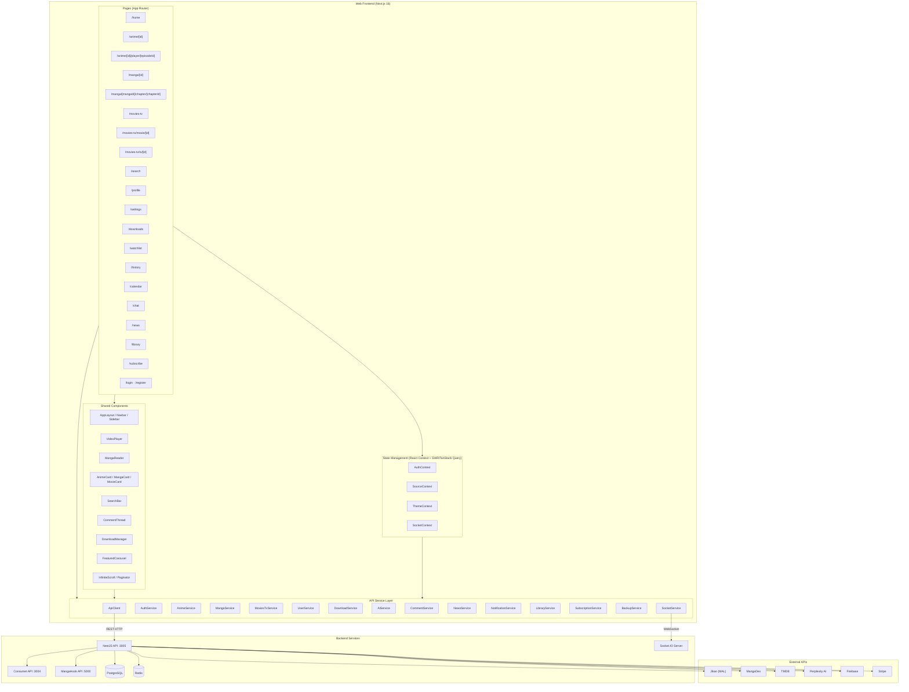
```mermaid
graph TB
    subgraph Client["Web Frontend (Next.js 16)"]
        subgraph Pages["Pages (App Router)"]
            P_HOME["/home"]
            P_ANIME["/anime/[id]"]
            P_PLAYER["/anime/[id]/player/[episodeId]"]
            P_MANGA["/manga/[id]"]
            P_READER["/manga/[mangaId]/chapter/[chapterId]"]
            P_MOVIES["/movies-tv"]
            P_MOVIE_D["/movies-tv/movie/[id]"]
            P_TV_D["/movies-tv/tv/[id]"]
            P_SEARCH["/search"]
            P_PROFILE["/profile"]
            P_SETTINGS["/settings"]
            P_DOWNLOADS["/downloads"]
            P_WATCHLIST["/watchlist"]
            P_HISTORY["/history"]
            P_CALENDAR["/calendar"]
            P_CHAT["/chat"]
            P_NEWS["/news"]
            P_LIBRARY["/library"]
            P_SUBSCRIBE["/subscribe"]
            P_AUTH["/login · /register"]
        end

        subgraph Components["Shared Components"]
            C_LAYOUT[AppLayout / Navbar / Sidebar]
            C_PLAYER[VideoPlayer]
            C_READER[MangaReader]
            C_CARDS[AnimeCard / MangaCard / MovieCard]
            C_SEARCH[SearchBar]
            C_COMMENTS[CommentThread]
            C_DOWNLOAD[DownloadManager]
            C_CAROUSEL[FeaturedCarousel]
            C_PAGINATION[InfiniteScroll / Paginator]
        end

        subgraph State["State Management (React Context + SWR/TanStack Query)"]
            S_AUTH[AuthContext]
            S_SOURCE[SourceContext]
            S_THEME[ThemeContext]
            S_SOCKET[SocketContext]
        end

        subgraph Services["API Service Layer"]
            SVC_API[ApiClient]
            SVC_AUTH[AuthService]
            SVC_ANIME[AnimeService]
            SVC_MANGA[MangaService]
            SVC_MOVIES[MoviesTvService]
            SVC_USER[UserService]
            SVC_DL[DownloadService]
            SVC_AI[AiService]
            SVC_COMMENTS[CommentService]
            SVC_NEWS[NewsService]
            SVC_NOTIF[NotificationService]
            SVC_LIBRARY[LibraryService]
            SVC_SUB[SubscriptionService]
            SVC_BACKUP[BackupService]
            SVC_SOCKET[SocketService]
        end
    end

    subgraph Backend["Backend Services"]
        API["NestJS API :3005"]
        WS["Socket.IO Server"]
        CONSUMET["Consumet API :3004"]
        MANGAHOOK["MangaHook API :5000"]
        DB[(PostgreSQL)]
        CACHE[(Redis)]
    end

    subgraph External["External APIs"]
        JIKAN["Jikan (MAL)"]
        MANGADEX["MangaDex"]
        TMDB["TMDB"]
        PERPLEXITY["Perplexity AI"]
        FIREBASE["Firebase"]
        STRIPE["Stripe"]
    end

    Pages --> Components
    Pages --> State
    Pages --> Services
    Components --> Services
    State --> Services

    SVC_API -->|REST HTTP| API
    SVC_SOCKET -->|WebSocket| WS

    API --> DB
    API --> CACHE
    API --> CONSUMET
    API --> MANGAHOOK
    API --> JIKAN
    API --> MANGADEX
    API --> TMDB
    API --> PERPLEXITY
    API --> FIREBASE
    API --> STRIPE
```

### 3.2 Page-Component Mapping

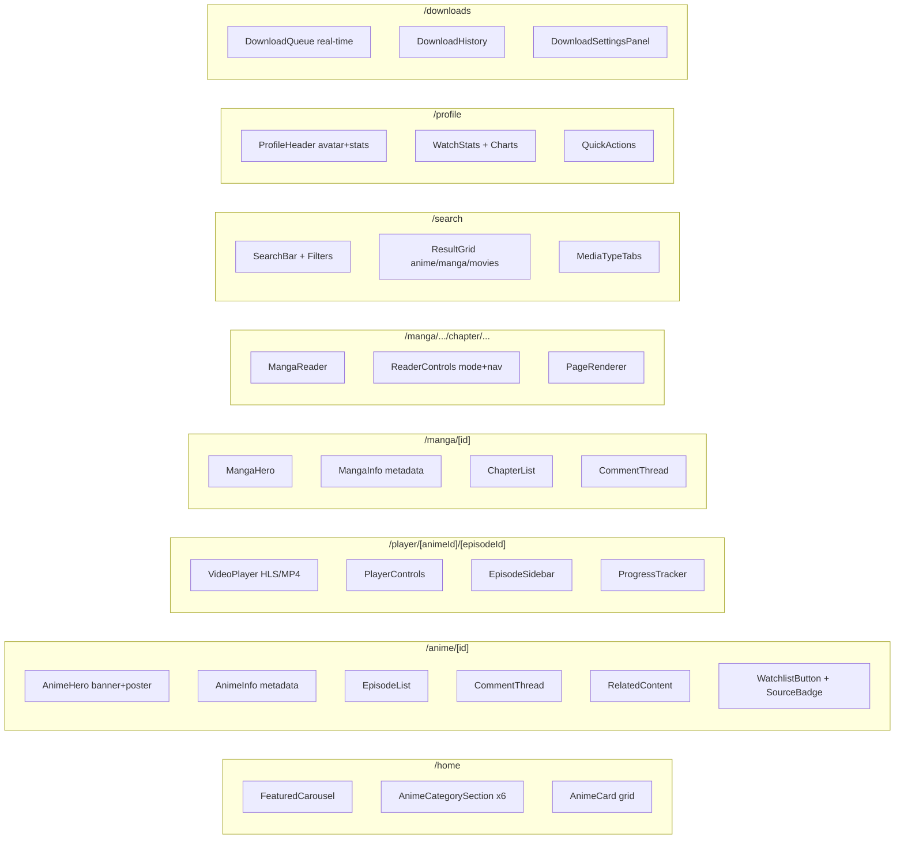
```mermaid
graph LR
    subgraph HomePage["/home"]
        H_CAROUSEL[FeaturedCarousel]
        H_SECTIONS[AnimeCategorySection x6]
        H_CARDS[AnimeCard grid]
    end

    subgraph AnimeDetailPage["/anime/[id]"]
        AD_HERO[AnimeHero banner+poster]
        AD_INFO[AnimeInfo metadata]
        AD_EPISODES[EpisodeList]
        AD_COMMENTS[CommentThread]
        AD_RELATED[RelatedContent]
        AD_ACTIONS[WatchlistButton + SourceBadge]
    end

    subgraph PlayerPage["/player/[animeId]/[episodeId]"]
        PL_VIDEO[VideoPlayer HLS/MP4]
        PL_CONTROLS[PlayerControls]
        PL_EPISODES[EpisodeSidebar]
        PL_PROGRESS[ProgressTracker]
    end

    subgraph MangaDetailPage["/manga/[id]"]
        MD_HERO[MangaHero]
        MD_INFO[MangaInfo metadata]
        MD_CHAPTERS[ChapterList]
        MD_COMMENTS[CommentThread]
    end

    subgraph ReaderPage["/manga/.../chapter/..."]
        RD_READER[MangaReader]
        RD_CONTROLS[ReaderControls mode+nav]
        RD_PAGES[PageRenderer]
    end

    subgraph SearchPage["/search"]
        SP_BAR[SearchBar + Filters]
        SP_RESULTS[ResultGrid anime/manga/movies]
        SP_TABS[MediaTypeTabs]
    end

    subgraph ProfilePage["/profile"]
        PR_HEADER[ProfileHeader avatar+stats]
        PR_STATS[WatchStats + Charts]
        PR_ACTIONS[QuickActions]
    end

    subgraph DownloadsPage["/downloads"]
        DL_QUEUE[DownloadQueue real-time]
        DL_HISTORY[DownloadHistory]
        DL_SETTINGS[DownloadSettingsPanel]
    end
```

### 3.3 Next.js App Router Structure

```
web/
├── app/
│   ├── layout.tsx                  # Root layout (Navbar, Sidebar, Providers)
│   ├── page.tsx                    # Redirect → /home
│   ├── (auth)/
│   │   ├── login/page.tsx
│   │   └── register/page.tsx
│   ├── (main)/
│   │   ├── layout.tsx              # Authenticated layout with navigation
│   │   ├── home/page.tsx
│   │   ├── anime/
│   │   │   ├── page.tsx            # Browse/list
│   │   │   └── [id]/
│   │   │       ├── page.tsx        # Anime detail
│   │   │       └── player/
│   │   │           └── [episodeId]/page.tsx
│   │   ├── manga/
│   │   │   ├── page.tsx            # Browse/list
│   │   │   └── [id]/
│   │   │       ├── page.tsx        # Manga detail
│   │   │       └── chapter/
│   │   │           └── [chapterId]/page.tsx
│   │   ├── movies-tv/
│   │   │   ├── page.tsx            # Browse
│   │   │   ├── movie/[id]/page.tsx
│   │   │   └── tv/[id]/page.tsx
│   │   ├── search/page.tsx
│   │   ├── calendar/page.tsx
│   │   ├── news/
│   │   │   ├── page.tsx
│   │   │   └── [id]/page.tsx
│   │   ├── chat/page.tsx
│   │   ├── profile/page.tsx
│   │   ├── settings/page.tsx
│   │   ├── watchlist/page.tsx
│   │   ├── history/page.tsx
│   │   ├── downloads/page.tsx
│   │   ├── library/page.tsx
│   │   └── subscribe/page.tsx
│   └── api/                        # Optional BFF endpoints
├── components/
│   ├── layout/
│   │   ├── Navbar.tsx
│   │   ├── Sidebar.tsx
│   │   ├── MobileNav.tsx
│   │   └── Footer.tsx
│   ├── anime/
│   │   ├── AnimeCard.tsx
│   │   ├── AnimeHero.tsx
│   │   ├── EpisodeList.tsx
│   │   ├── EpisodeCard.tsx
│   │   └── AnimeCategorySection.tsx
│   ├── manga/
│   │   ├── MangaCard.tsx
│   │   ├── MangaHero.tsx
│   │   ├── ChapterList.tsx
│   │   └── MangaReader.tsx
│   ├── movies/
│   │   ├── MovieCard.tsx
│   │   ├── TvShowCard.tsx
│   │   └── CastGrid.tsx
│   ├── player/
│   │   ├── VideoPlayer.tsx
│   │   ├── PlayerControls.tsx
│   │   └── EpisodeSidebar.tsx
│   ├── common/
│   │   ├── SearchBar.tsx
│   │   ├── FeaturedCarousel.tsx
│   │   ├── CommentThread.tsx
│   │   ├── InfiniteScroll.tsx
│   │   ├── Skeleton.tsx
│   │   ├── MediaTypeTabs.tsx
│   │   └── RatingStars.tsx
│   ├── downloads/
│   │   ├── DownloadQueue.tsx
│   │   ├── DownloadProgress.tsx
│   │   └── DownloadSettingsPanel.tsx
│   ├── chat/
│   │   ├── ChatBubble.tsx
│   │   └── ChatInput.tsx
│   └── ui/                         # Primitives (Button, Modal, Dropdown, etc.)
├── services/
│   ├── api-client.ts
│   ├── auth.service.ts
│   ├── anime.service.ts
│   ├── manga.service.ts
│   ├── movies-tv.service.ts
│   ├── user.service.ts
│   ├── download.service.ts
│   ├── ai.service.ts
│   ├── comment.service.ts
│   ├── news.service.ts
│   ├── notification.service.ts
│   ├── library.service.ts
│   ├── subscription.service.ts
│   ├── backup.service.ts
│   └── socket.service.ts
├── hooks/
│   ├── useAuth.ts
│   ├── useAnime.ts
│   ├── useManga.ts
│   ├── useMoviesTv.ts
│   ├── useUser.ts
│   ├── useDownloads.ts
│   ├── useComments.ts
│   ├── useLibrary.ts
│   ├── useSubscription.ts
│   ├── useSocket.ts
│   └── useInfiniteScroll.ts
├── contexts/
│   ├── AuthContext.tsx
│   ├── SourceContext.tsx
│   ├── SocketContext.tsx
│   └── ThemeContext.tsx
├── types/
│   ├── anime.ts
│   ├── manga.ts
│   ├── movies-tv.ts
│   ├── user.ts
│   ├── download.ts
│   ├── comment.ts
│   ├── news.ts
│   ├── chat.ts
│   └── api.ts
├── lib/
│   └── utils.ts
└── styles/
    └── globals.css
```

---

## 4. Sequence Diagrams

### 4.1 Authentication Flow — Login

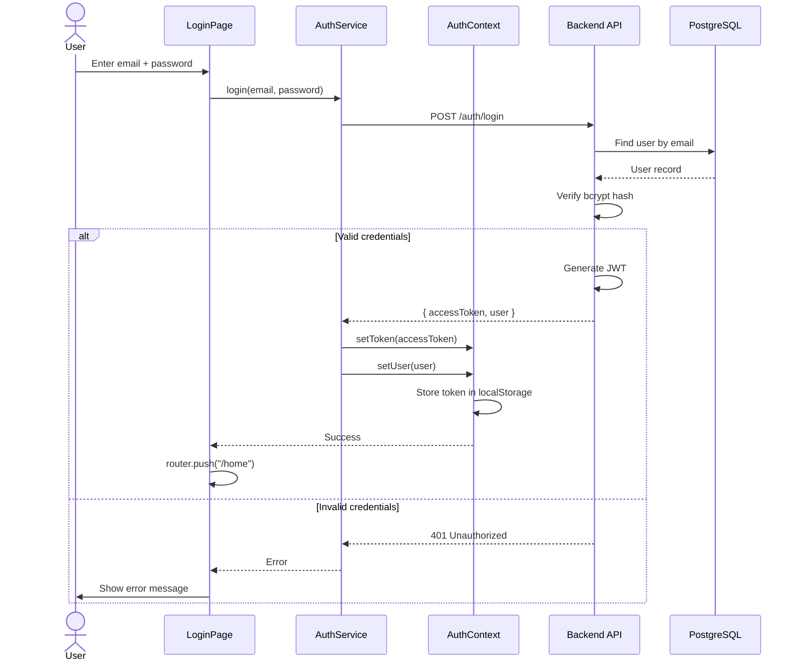
```mermaid
sequenceDiagram
    actor U as User
    participant LP as LoginPage
    participant AS as AuthService
    participant AC as AuthContext
    participant API as Backend API
    participant DB as PostgreSQL

    U->>LP: Enter email + password
    LP->>AS: login(email, password)
    AS->>API: POST /auth/login
    API->>DB: Find user by email
    DB-->>API: User record
    API->>API: Verify bcrypt hash
    alt Valid credentials
        API->>API: Generate JWT
        API-->>AS: { accessToken, user }
        AS->>AC: setToken(accessToken)
        AS->>AC: setUser(user)
        AC->>AC: Store token in localStorage
        AC-->>LP: Success
        LP->>LP: router.push("/home")
    else Invalid credentials
        API-->>AS: 401 Unauthorized
        AS-->>LP: Error
        LP->>U: Show error message
    end
```

### 4.2 Authentication Flow — Google OAuth

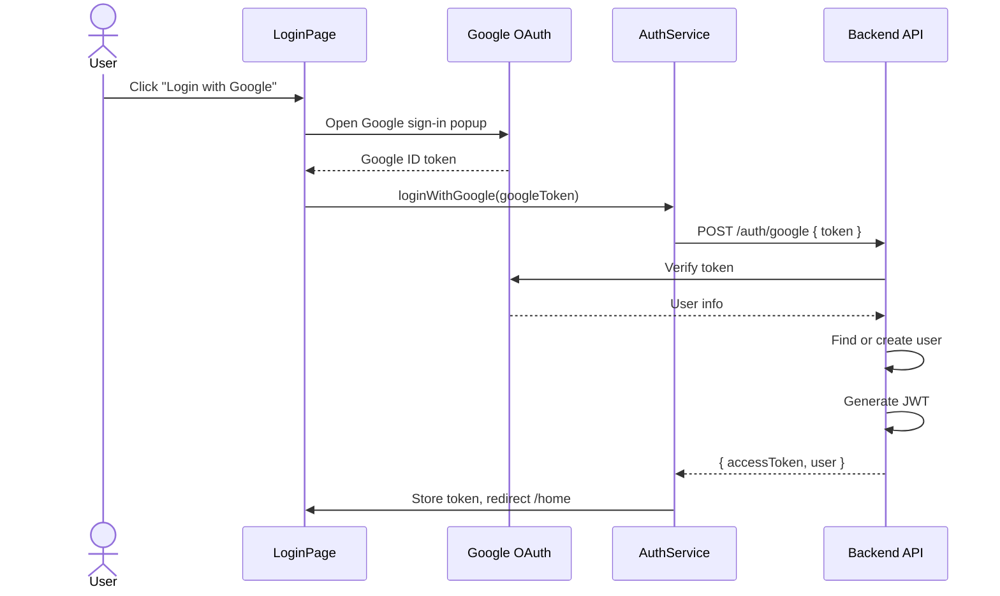
```mermaid
sequenceDiagram
    actor U as User
    participant LP as LoginPage
    participant GOOGLE as Google OAuth
    participant AS as AuthService
    participant API as Backend API

    U->>LP: Click "Login with Google"
    LP->>GOOGLE: Open Google sign-in popup
    GOOGLE-->>LP: Google ID token
    LP->>AS: loginWithGoogle(googleToken)
    AS->>API: POST /auth/google { token }
    API->>GOOGLE: Verify token
    GOOGLE-->>API: User info
    API->>API: Find or create user
    API->>API: Generate JWT
    API-->>AS: { accessToken, user }
    AS->>LP: Store token, redirect /home
```

### 4.3 Anime Browsing & Streaming

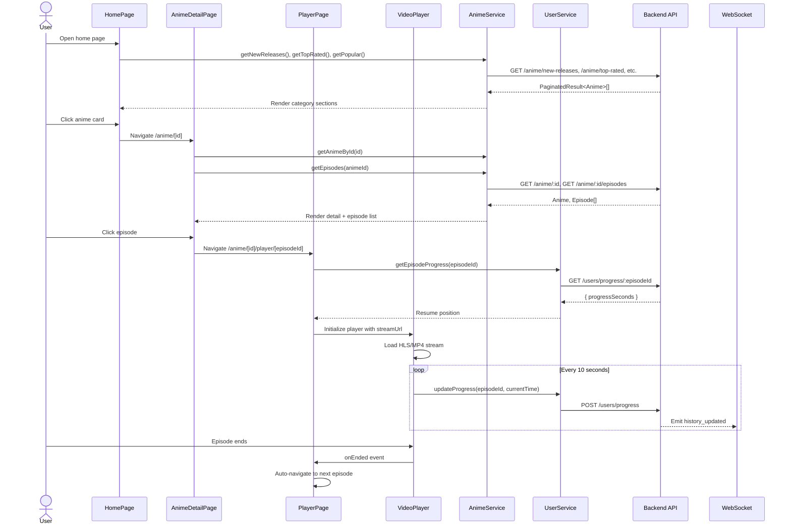
```mermaid
sequenceDiagram
    actor U as User
    participant HP as HomePage
    participant ADP as AnimeDetailPage
    participant PP as PlayerPage
    participant VP as VideoPlayer
    participant SVC as AnimeService
    participant USR as UserService
    participant API as Backend API
    participant WS as WebSocket

    U->>HP: Open home page
    HP->>SVC: getNewReleases(), getTopRated(), getPopular()
    SVC->>API: GET /anime/new-releases, /anime/top-rated, etc.
    API-->>SVC: PaginatedResult<Anime>[]
    SVC-->>HP: Render category sections

    U->>HP: Click anime card
    HP->>ADP: Navigate /anime/[id]
    ADP->>SVC: getAnimeById(id)
    ADP->>SVC: getEpisodes(animeId)
    SVC->>API: GET /anime/:id, GET /anime/:id/episodes
    API-->>SVC: Anime, Episode[]
    SVC-->>ADP: Render detail + episode list

    U->>ADP: Click episode
    ADP->>PP: Navigate /anime/[id]/player/[episodeId]
    PP->>USR: getEpisodeProgress(episodeId)
    USR->>API: GET /users/progress/:episodeId
    API-->>USR: { progressSeconds }
    USR-->>PP: Resume position

    PP->>VP: Initialize player with streamUrl
    VP->>VP: Load HLS/MP4 stream

    loop Every 10 seconds
        VP->>USR: updateProgress(episodeId, currentTime)
        USR->>API: POST /users/progress
        API-->>WS: Emit history_updated
    end

    U->>VP: Episode ends
    VP->>PP: onEnded event
    PP->>PP: Auto-navigate to next episode
```

### 4.4 Manga Reading Flow

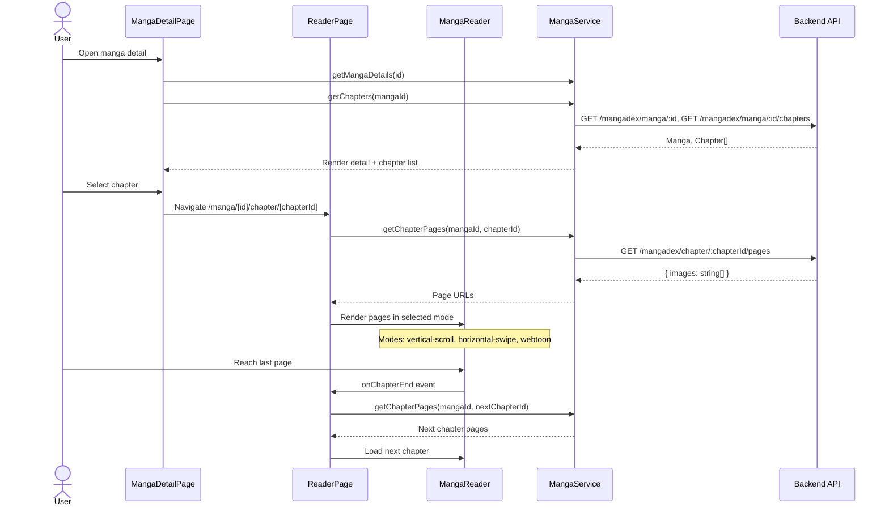
```mermaid
sequenceDiagram
    actor U as User
    participant MDP as MangaDetailPage
    participant RP as ReaderPage
    participant MR as MangaReader
    participant SVC as MangaService
    participant API as Backend API

    U->>MDP: Open manga detail
    MDP->>SVC: getMangaDetails(id)
    MDP->>SVC: getChapters(mangaId)
    SVC->>API: GET /mangadex/manga/:id, GET /mangadex/manga/:id/chapters
    API-->>SVC: Manga, Chapter[]
    SVC-->>MDP: Render detail + chapter list

    U->>MDP: Select chapter
    MDP->>RP: Navigate /manga/[id]/chapter/[chapterId]
    RP->>SVC: getChapterPages(mangaId, chapterId)
    SVC->>API: GET /mangadex/chapter/:chapterId/pages
    API-->>SVC: { images: string[] }
    SVC-->>RP: Page URLs

    RP->>MR: Render pages in selected mode
    Note over MR: Modes: vertical-scroll, horizontal-swipe, webtoon

    U->>MR: Reach last page
    MR->>RP: onChapterEnd event
    RP->>SVC: getChapterPages(mangaId, nextChapterId)
    SVC-->>RP: Next chapter pages
    RP->>MR: Load next chapter
```

### 4.5 Download with Real-Time Progress

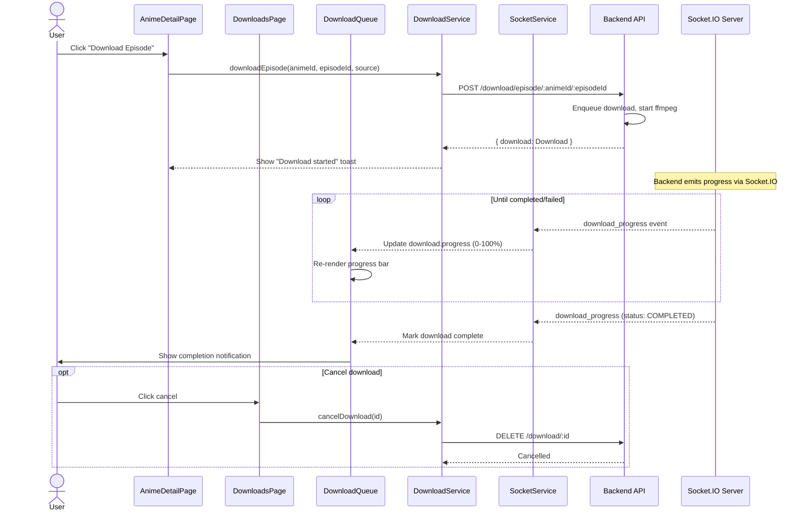
```mermaid
sequenceDiagram
    actor U as User
    participant ADP as AnimeDetailPage
    participant DLP as DownloadsPage
    participant DQ as DownloadQueue
    participant DS as DownloadService
    participant SS as SocketService
    participant API as Backend API
    participant WS as Socket.IO Server

    U->>ADP: Click "Download Episode"
    ADP->>DS: downloadEpisode(animeId, episodeId, source)
    DS->>API: POST /download/episode/:animeId/:episodeId
    API->>API: Enqueue download, start ffmpeg
    API-->>DS: { download: Download }
    DS-->>ADP: Show "Download started" toast

    Note over WS: Backend emits progress via Socket.IO

    loop Until completed/failed
        WS-->>SS: download_progress event
        SS-->>DQ: Update download.progress (0-100%)
        DQ->>DQ: Re-render progress bar
    end

    WS-->>SS: download_progress (status: COMPLETED)
    SS-->>DQ: Mark download complete
    DQ->>U: Show completion notification

    opt Cancel download
        U->>DLP: Click cancel
        DLP->>DS: cancelDownload(id)
        DS->>API: DELETE /download/:id
        API-->>DS: Cancelled
    end
```

### 4.6 AI Chat & Recommendations

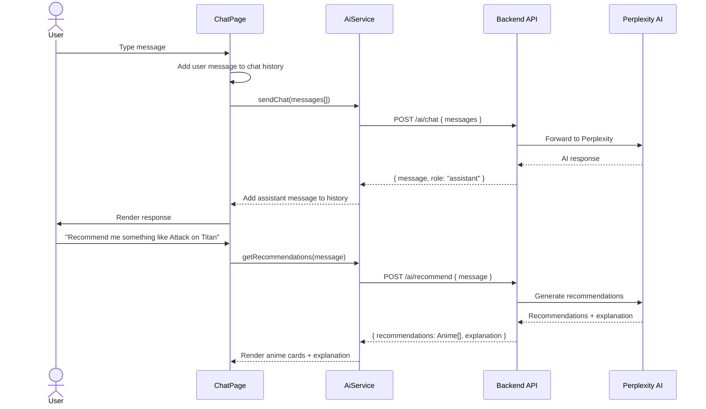
```mermaid
sequenceDiagram
    actor U as User
    participant CP as ChatPage
    participant AI as AiService
    participant API as Backend API
    participant PERP as Perplexity AI

    U->>CP: Type message
    CP->>CP: Add user message to chat history
    CP->>AI: sendChat(messages[])
    AI->>API: POST /ai/chat { messages }
    API->>PERP: Forward to Perplexity
    PERP-->>API: AI response
    API-->>AI: { message, role: "assistant" }
    AI-->>CP: Add assistant message to history
    CP->>U: Render response

    U->>CP: "Recommend me something like Attack on Titan"
    CP->>AI: getRecommendations(message)
    AI->>API: POST /ai/recommend { message }
    API->>PERP: Generate recommendations
    PERP-->>API: Recommendations + explanation
    API-->>AI: { recommendations: Anime[], explanation }
    AI-->>CP: Render anime cards + explanation
```

### 4.7 Comment & Rating Flow

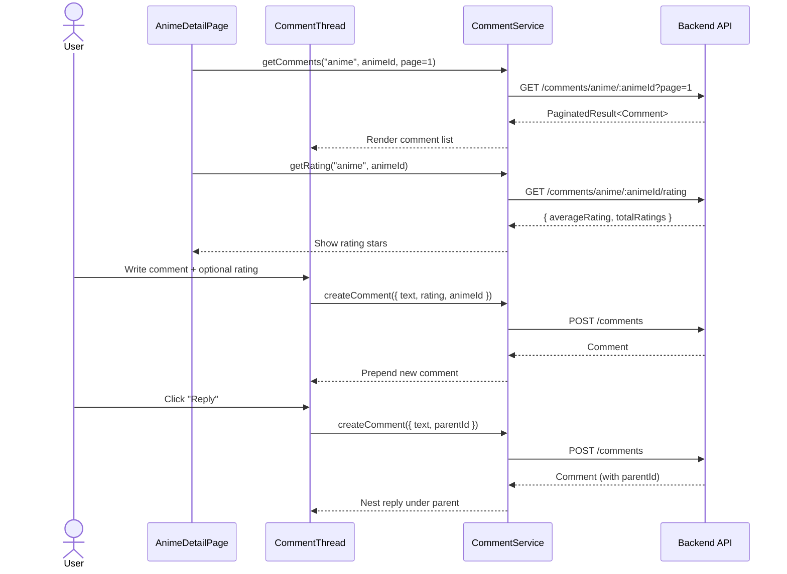
```mermaid
sequenceDiagram
    actor U as User
    participant ADP as AnimeDetailPage
    participant CT as CommentThread
    participant CS as CommentService
    participant API as Backend API

    ADP->>CS: getComments("anime", animeId, page=1)
    CS->>API: GET /comments/anime/:animeId?page=1
    API-->>CS: PaginatedResult<Comment>
    CS-->>CT: Render comment list

    ADP->>CS: getRating("anime", animeId)
    CS->>API: GET /comments/anime/:animeId/rating
    API-->>CS: { averageRating, totalRatings }
    CS-->>ADP: Show rating stars

    U->>CT: Write comment + optional rating
    CT->>CS: createComment({ text, rating, animeId })
    CS->>API: POST /comments
    API-->>CS: Comment
    CS-->>CT: Prepend new comment

    U->>CT: Click "Reply"
    CT->>CS: createComment({ text, parentId })
    CS->>API: POST /comments
    API-->>CS: Comment (with parentId)
    CS-->>CT: Nest reply under parent
```

### 4.8 Movies/TV Streaming Flow

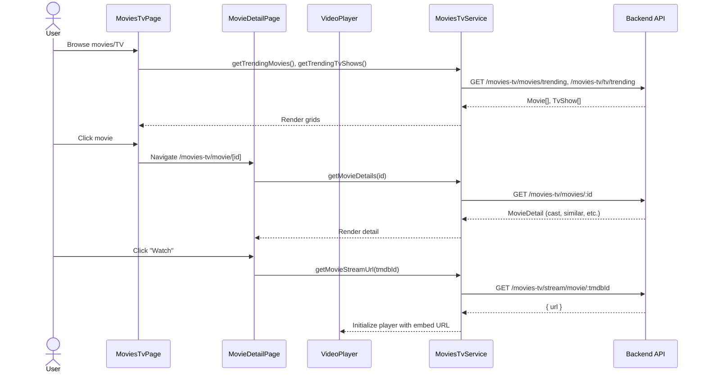
```mermaid
sequenceDiagram
    actor U as User
    participant MTP as MoviesTvPage
    participant MDP as MovieDetailPage
    participant VP as VideoPlayer
    participant SVC as MoviesTvService
    participant API as Backend API

    U->>MTP: Browse movies/TV
    MTP->>SVC: getTrendingMovies(), getTrendingTvShows()
    SVC->>API: GET /movies-tv/movies/trending, /movies-tv/tv/trending
    API-->>SVC: Movie[], TvShow[]
    SVC-->>MTP: Render grids

    U->>MTP: Click movie
    MTP->>MDP: Navigate /movies-tv/movie/[id]
    MDP->>SVC: getMovieDetails(id)
    SVC->>API: GET /movies-tv/movies/:id
    API-->>SVC: MovieDetail (cast, similar, etc.)
    SVC-->>MDP: Render detail

    U->>MDP: Click "Watch"
    MDP->>SVC: getMovieStreamUrl(tmdbId)
    SVC->>API: GET /movies-tv/stream/movie/:tmdbId
    API-->>SVC: { url }
    SVC-->>VP: Initialize player with embed URL
```

### 4.9 Library Browsing & Local Playback

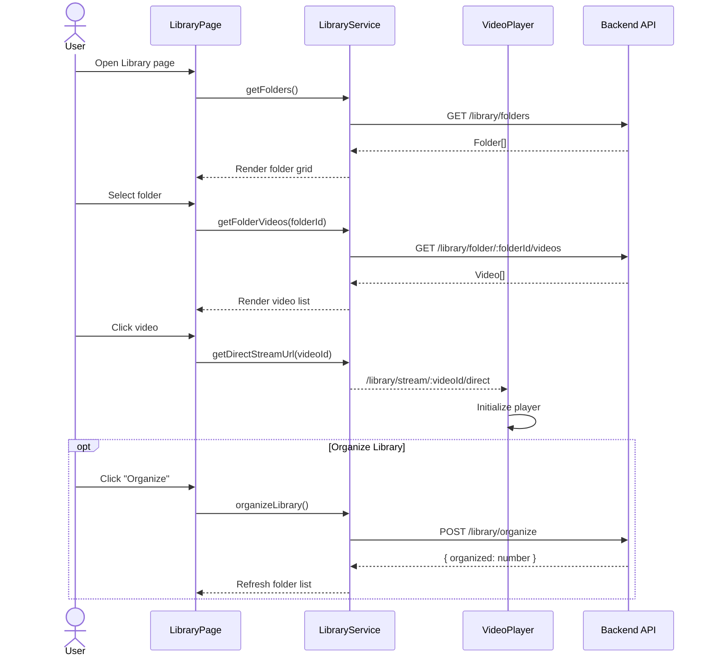
```mermaid
sequenceDiagram
    actor U as User
    participant LP as LibraryPage
    participant LS as LibraryService
    participant VP as VideoPlayer
    participant API as Backend API

    U->>LP: Open Library page
    LP->>LS: getFolders()
    LS->>API: GET /library/folders
    API-->>LS: Folder[]
    LS-->>LP: Render folder grid

    U->>LP: Select folder
    LP->>LS: getFolderVideos(folderId)
    LS->>API: GET /library/folder/:folderId/videos
    API-->>LS: Video[]
    LS-->>LP: Render video list

    U->>LP: Click video
    LP->>LS: getDirectStreamUrl(videoId)
    LS-->>VP: /library/stream/:videoId/direct
    VP->>VP: Initialize player

    opt Organize Library
        U->>LP: Click "Organize"
        LP->>LS: organizeLibrary()
        LS->>API: POST /library/organize
        API-->>LS: { organized: number }
        LS-->>LP: Refresh folder list
    end
```

### 4.10 Stripe Subscription Flow

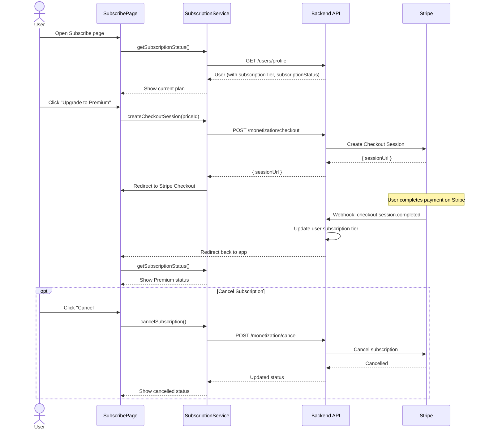
```mermaid
sequenceDiagram
    actor U as User
    participant SP as SubscribePage
    participant SS as SubscriptionService
    participant API as Backend API
    participant STRIPE as Stripe

    U->>SP: Open Subscribe page
    SP->>SS: getSubscriptionStatus()
    SS->>API: GET /users/profile
    API-->>SS: User (with subscriptionTier, subscriptionStatus)
    SS-->>SP: Show current plan

    U->>SP: Click "Upgrade to Premium"
    SP->>SS: createCheckoutSession(priceId)
    SS->>API: POST /monetization/checkout
    API->>STRIPE: Create Checkout Session
    STRIPE-->>API: { sessionUrl }
    API-->>SS: { sessionUrl }
    SS->>SP: Redirect to Stripe Checkout

    Note over STRIPE: User completes payment on Stripe

    STRIPE->>API: Webhook: checkout.session.completed
    API->>API: Update user subscription tier
    API-->>SP: Redirect back to app

    SP->>SS: getSubscriptionStatus()
    SS-->>SP: Show Premium status

    opt Cancel Subscription
        U->>SP: Click "Cancel"
        SP->>SS: cancelSubscription()
        SS->>API: POST /monetization/cancel
        API->>STRIPE: Cancel subscription
        STRIPE-->>API: Cancelled
        API-->>SS: Updated status
        SS-->>SP: Show cancelled status
    end
```

---

## 5. Activity Diagrams

### 5.1 User Registration & Onboarding

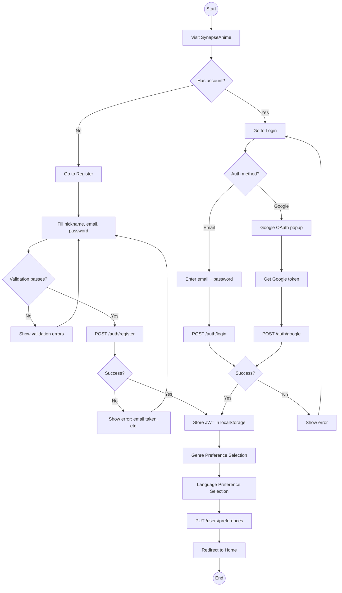
```mermaid
flowchart TD
    START((Start)) --> VISIT[Visit SynapseAnime]
    VISIT --> HAS_ACCOUNT{Has account?}

    HAS_ACCOUNT -->|Yes| LOGIN_PAGE[Go to Login]
    HAS_ACCOUNT -->|No| REGISTER_PAGE[Go to Register]

    REGISTER_PAGE --> FILL_FORM[Fill nickname, email, password]
    FILL_FORM --> VALIDATE{Validation passes?}
    VALIDATE -->|No| SHOW_ERRORS[Show validation errors]
    SHOW_ERRORS --> FILL_FORM

    VALIDATE -->|Yes| SUBMIT[POST /auth/register]
    SUBMIT --> REG_SUCCESS{Success?}
    REG_SUCCESS -->|No| REG_ERROR[Show error: email taken, etc.]
    REG_ERROR --> FILL_FORM

    REG_SUCCESS -->|Yes| STORE_TOKEN[Store JWT in localStorage]
    STORE_TOKEN --> SELECT_GENRES[Genre Preference Selection]
    SELECT_GENRES --> SELECT_LANG[Language Preference Selection]
    SELECT_LANG --> SAVE_PREFS[PUT /users/preferences]
    SAVE_PREFS --> HOME[Redirect to Home]

    LOGIN_PAGE --> AUTH_METHOD{Auth method?}
    AUTH_METHOD -->|Email| ENTER_CREDS[Enter email + password]
    AUTH_METHOD -->|Google| GOOGLE_POPUP[Google OAuth popup]

    ENTER_CREDS --> LOGIN_SUBMIT[POST /auth/login]
    GOOGLE_POPUP --> GOOGLE_TOKEN[Get Google token]
    GOOGLE_TOKEN --> GOOGLE_SUBMIT[POST /auth/google]

    LOGIN_SUBMIT --> LOGIN_OK{Success?}
    GOOGLE_SUBMIT --> LOGIN_OK

    LOGIN_OK -->|No| LOGIN_ERR[Show error]
    LOGIN_ERR --> LOGIN_PAGE
    LOGIN_OK -->|Yes| STORE_TOKEN

    HOME --> END((End))
```

### 5.2 Anime Discovery & Watching

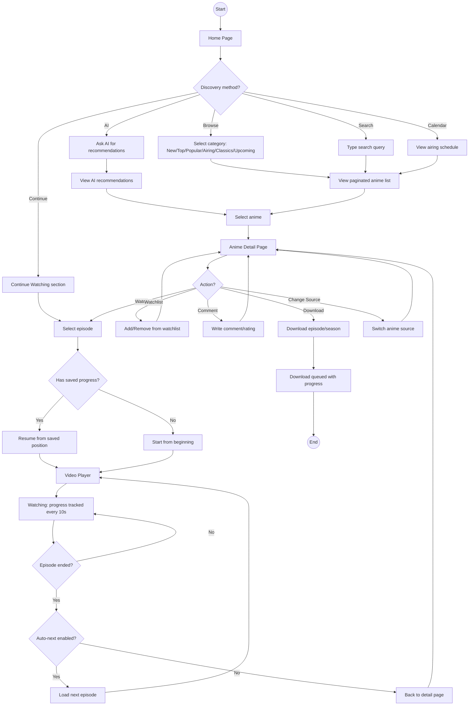
```mermaid
flowchart TD
    START((Start)) --> HOME[Home Page]
    HOME --> DISCOVER{Discovery method?}

    DISCOVER -->|Browse| CATEGORY[Select category: New/Top/Popular/Airing/Classics/Upcoming]
    DISCOVER -->|Search| SEARCH[Type search query]
    DISCOVER -->|Calendar| CALENDAR[View airing schedule]
    DISCOVER -->|Continue| CONTINUE[Continue Watching section]
    DISCOVER -->|AI| CHAT[Ask AI for recommendations]

    CATEGORY --> LIST[View paginated anime list]
    SEARCH --> LIST
    CALENDAR --> LIST
    CHAT --> RECS[View AI recommendations]
    RECS --> SELECT_ANIME

    LIST --> SELECT_ANIME[Select anime]
    CONTINUE --> SELECT_EPISODE

    SELECT_ANIME --> DETAIL[Anime Detail Page]
    DETAIL --> ACTIONS{Action?}

    ACTIONS -->|Watch| SELECT_EPISODE[Select episode]
    ACTIONS -->|Watchlist| TOGGLE_WL[Add/Remove from watchlist]
    ACTIONS -->|Comment| WRITE_COMMENT[Write comment/rating]
    ACTIONS -->|Download| DL_EP[Download episode/season]
    ACTIONS -->|Change Source| SWITCH[Switch anime source]

    TOGGLE_WL --> DETAIL
    WRITE_COMMENT --> DETAIL
    DL_EP --> DL_QUEUE[Download queued with progress]
    SWITCH --> DETAIL

    SELECT_EPISODE --> CHECK_PROGRESS{Has saved progress?}
    CHECK_PROGRESS -->|Yes| RESUME[Resume from saved position]
    CHECK_PROGRESS -->|No| PLAY[Start from beginning]

    RESUME --> PLAYER[Video Player]
    PLAY --> PLAYER

    PLAYER --> WATCHING[Watching: progress tracked every 10s]
    WATCHING --> EP_END{Episode ended?}
    EP_END -->|No| WATCHING
    EP_END -->|Yes| AUTO_NEXT{Auto-next enabled?}
    AUTO_NEXT -->|Yes| NEXT_EP[Load next episode]
    AUTO_NEXT -->|No| BACK_DETAIL[Back to detail page]
    NEXT_EP --> PLAYER
    BACK_DETAIL --> DETAIL

    DL_QUEUE --> END((End))
```

### 5.3 Manga Discovery & Reading

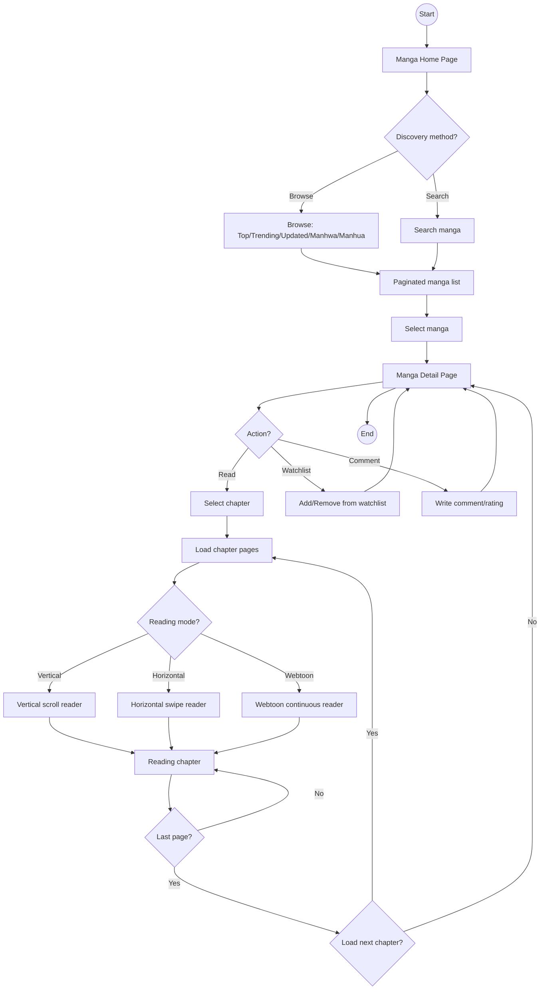
```mermaid
flowchart TD
    START((Start)) --> MANGA_HOME[Manga Home Page]
    MANGA_HOME --> DISCOVER{Discovery method?}

    DISCOVER -->|Browse| BROWSE[Browse: Top/Trending/Updated/Manhwa/Manhua]
    DISCOVER -->|Search| SEARCH[Search manga]

    BROWSE --> LIST[Paginated manga list]
    SEARCH --> LIST

    LIST --> SELECT[Select manga]
    SELECT --> DETAIL[Manga Detail Page]
    DETAIL --> ACTIONS{Action?}

    ACTIONS -->|Read| SELECT_CH[Select chapter]
    ACTIONS -->|Watchlist| TOGGLE_WL[Add/Remove from watchlist]
    ACTIONS -->|Comment| COMMENT[Write comment/rating]

    TOGGLE_WL --> DETAIL
    COMMENT --> DETAIL

    SELECT_CH --> LOAD_PAGES[Load chapter pages]
    LOAD_PAGES --> MODE{Reading mode?}

    MODE -->|Vertical| VERT[Vertical scroll reader]
    MODE -->|Horizontal| HORIZ[Horizontal swipe reader]
    MODE -->|Webtoon| WEBTOON[Webtoon continuous reader]

    VERT --> READING[Reading chapter]
    HORIZ --> READING
    WEBTOON --> READING

    READING --> LAST_PAGE{Last page?}
    LAST_PAGE -->|No| READING
    LAST_PAGE -->|Yes| NEXT{Load next chapter?}
    NEXT -->|Yes| LOAD_PAGES
    NEXT -->|No| DETAIL

    DETAIL --> END((End))
```

### 5.4 Search Across Media Types

```mermaid
flowchart TD
    START((Start)) --> SEARCH_PAGE[Search Page]
    SEARCH_PAGE --> SELECT_TYPE[Select media type tab: Anime / Manga / Movies / TV]
    SELECT_TYPE --> ENTER_QUERY[Enter search query]
    ENTER_QUERY --> DEBOUNCE[Debounce 500ms]
    DEBOUNCE --> TYPE{Media type?}

    TYPE -->|Anime| ANIME_SEARCH[GET /jikan/anime/search?q=...]
    TYPE -->|Manga| MANGA_SEARCH[GET /mangadex/manga/search?q=...]
    TYPE -->|Movies| MOVIE_SEARCH[GET /movies-tv/search?q=...&type=movie]
    TYPE -->|TV| TV_SEARCH[GET /movies-tv/search?q=...&type=tv]

    ANIME_SEARCH --> RESULTS[Display result grid]
    MANGA_SEARCH --> RESULTS
    MOVIE_SEARCH --> RESULTS
    TV_SEARCH --> RESULTS

    RESULTS --> HAS_RESULTS{Results found?}
    HAS_RESULTS -->|No| EMPTY[Show "No results" message]
    HAS_RESULTS -->|Yes| SELECT[Click result]
    EMPTY --> ENTER_QUERY

    SELECT --> NAVIGATE{Navigate to?}
    NAVIGATE -->|Anime| ANIME_DETAIL[/anime/id]
    NAVIGATE -->|Manga| MANGA_DETAIL[/manga/id]
    NAVIGATE -->|Movie| MOVIE_DETAIL[/movies-tv/movie/id]
    NAVIGATE -->|TV| TV_DETAIL[/movies-tv/tv/id]
```

---

## 6. State Machine Diagrams

### 6.1 Authentication State

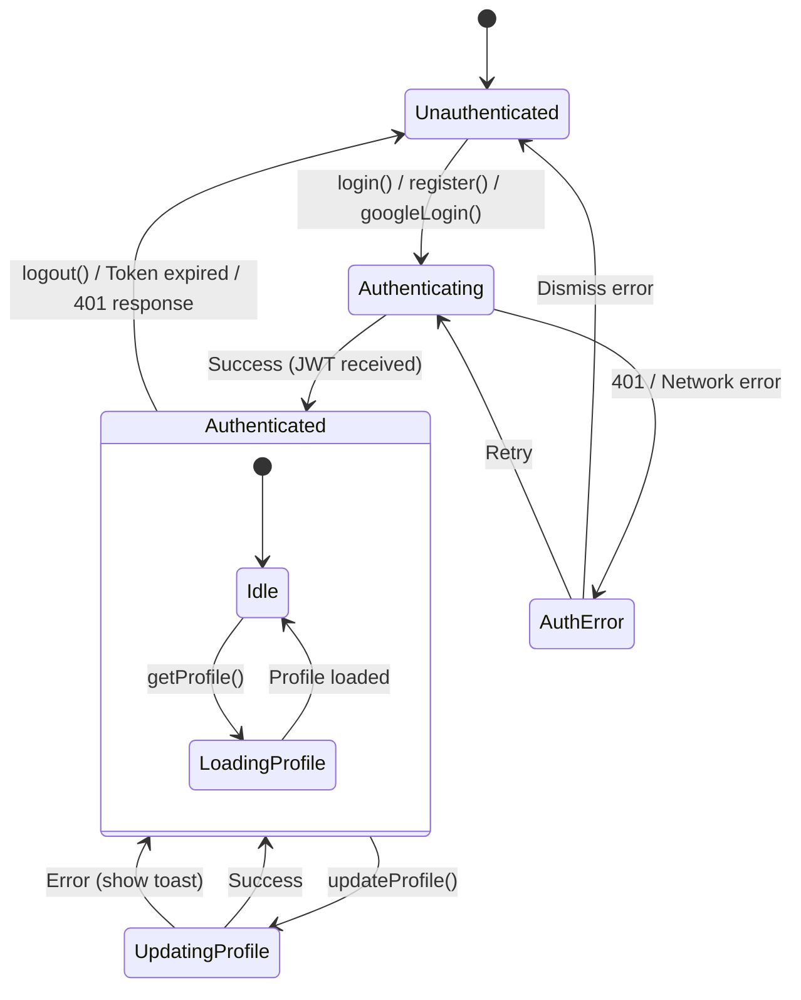
```mermaid
stateDiagram-v2
    [*] --> Unauthenticated

    Unauthenticated --> Authenticating : login() / register() / googleLogin()
    Authenticating --> Authenticated : Success (JWT received)
    Authenticating --> AuthError : 401 / Network error
    AuthError --> Unauthenticated : Dismiss error
    AuthError --> Authenticating : Retry

    Authenticated --> Unauthenticated : logout() / Token expired / 401 response
    Authenticated --> UpdatingProfile : updateProfile()
    UpdatingProfile --> Authenticated : Success
    UpdatingProfile --> Authenticated : Error (show toast)

    state Authenticated {
        [*] --> Idle
        Idle --> LoadingProfile : getProfile()
        LoadingProfile --> Idle : Profile loaded
    }
```

### 6.2 Video Player State

```mermaid
stateDiagram-v2
    [*] --> Idle

    Idle --> Loading : Load episode stream URL
    Loading --> Ready : Stream URL resolved
    Loading --> Error : URL resolution failed

    Ready --> Buffering : Player initializing
    Buffering --> Playing : Enough data buffered
    Buffering --> Error : Network failure

    Playing --> Paused : User pause / focus lost
    Playing --> Buffering : Buffer underrun
    Playing --> Seeking : User seeks
    Playing --> Ended : Playback complete

    Paused --> Playing : User resume
    Paused --> Seeking : User seeks

    Seeking --> Buffering : Seek to new position
    Seeking --> Playing : Data already buffered

    Ended --> Loading : Auto-next episode
    Ended --> Idle : No next episode / auto-next disabled

    Error --> Loading : Retry
    Error --> Idle : Give up / back

    state Playing {
        [*] --> Tracking
        Tracking --> Tracking : Save progress every 10s
    }
```

### 6.3 Download State

```mermaid
stateDiagram-v2
    [*] --> Idle

    Idle --> Pending : Request download
    Pending --> Downloading : Server starts processing

    Downloading --> Downloading : Progress update (0-100%)
    Downloading --> Completed : Progress = 100%
    Downloading --> Failed : Error (ffmpeg, network, disk)
    Downloading --> Cancelled : User cancels

    Failed --> Pending : Retry download
    Failed --> Idle : Delete download record

    Completed --> Idle : Delete file + record
    Cancelled --> Idle : Clear from queue

    state Downloading {
        [*] --> InProgress
        InProgress --> InProgress : WebSocket progress event
    }
```

### 6.4 Manga Reader State

```mermaid
stateDiagram-v2
    [*] --> Idle

    Idle --> LoadingChapter : Open chapter
    LoadingChapter --> ChapterReady : Pages loaded
    LoadingChapter --> Error : Load failed

    ChapterReady --> Reading : Render pages

    state Reading {
        [*] --> VerticalScroll
        VerticalScroll --> HorizontalSwipe : Switch mode
        VerticalScroll --> WebtoonMode : Switch mode
        HorizontalSwipe --> VerticalScroll : Switch mode
        HorizontalSwipe --> WebtoonMode : Switch mode
        WebtoonMode --> VerticalScroll : Switch mode
        WebtoonMode --> HorizontalSwipe : Switch mode
    }

    Reading --> LoadingChapter : Next/Previous chapter
    Reading --> Idle : Exit reader

    Error --> LoadingChapter : Retry
    Error --> Idle : Back to detail
```

### 6.5 WebSocket Connection State

```mermaid
stateDiagram-v2
    [*] --> Disconnected

    Disconnected --> Connecting : User authenticated
    Connecting --> Connected : Socket handshake OK
    Connecting --> Disconnected : Auth failed / timeout

    Connected --> Disconnected : logout() / server disconnect
    Connected --> Reconnecting : Network drop

    Reconnecting --> Connected : Reconnect success
    Reconnecting --> Disconnected : Max retries exceeded

    state Connected {
        [*] --> Listening
        Listening --> Listening : download_progress event
        Listening --> Listening : history_updated event
    }
```

### 6.6 Anime Source State

```mermaid
stateDiagram-v2
    [*] --> LoadingSources

    LoadingSources --> SourcesLoaded : GET /anime/sources
    LoadingSources --> Error : Network failure

    state SourcesLoaded {
        [*] --> Jikan
        Jikan --> AnimeUnity : setActiveSource("animeunity")
        Jikan --> HiAnime : setActiveSource("hianime")
        AnimeUnity --> Jikan : setActiveSource("jikan")
        AnimeUnity --> HiAnime : setActiveSource("hianime")
        HiAnime --> Jikan : setActiveSource("jikan")
        HiAnime --> AnimeUnity : setActiveSource("animeunity")
    }

    Error --> LoadingSources : Retry
```

---

## 7. Deployment Diagram

### 7.1 Production Infrastructure

```mermaid
graph TB
    subgraph UserDevices["User Devices"]
        BROWSER["Web Browser\n(Chrome/Firefox/Safari)"]
        MOBILE["Mobile App\n(Flutter)"]
    end

    subgraph CDN["CDN / Reverse Proxy"]
        NGINX["Nginx / Caddy\nHTTPS termination\nStatic asset caching"]
    end

    subgraph LXC["LXC Container (Debian/Ubuntu)"]
        subgraph Node1["Node.js Process 1"]
            BACKEND["openanime-backend\nNestJS :3005\nREST API + Socket.IO"]
        end
        subgraph Node2["Node.js Process 2"]
            CONSUMET["openanime-consumet\nFastify :3004\nAnime provider aggregation"]
        end
        subgraph Node3["Node.js Process 3"]
            MANGAHOOK["openanime-mangahook\nNode.js :5000\nManga provider"]
        end
        subgraph Data["Data Layer"]
            PG[("PostgreSQL\nPort 5432\nDB: anime_player")]
            REDIS[("Redis\nPort 6379\nCache layer")]
        end
        subgraph Storage["File Storage"]
            VIDEO["video_library/\nDownloaded episodes\nServed at /downloads"]
            LOGS["/var/log/openanime/\nApplication logs"]
        end
    end

    subgraph External["External Services"]
        JIKAN["Jikan API\napi.jikan.moe/v4"]
        MANGADEX["MangaDex API\napi.mangadex.org"]
        TMDB["TMDB API\napi.themoviedb.org"]
        PERPLEXITY["Perplexity AI\nAI recommendations"]
        FIREBASE["Firebase\nPush notifications"]
        STRIPE["Stripe\nPayments"]
        GOOGLE["Google OAuth\nAuthentication"]
    end

    BROWSER -->|"HTTPS"| NGINX
    MOBILE -->|"HTTPS"| NGINX

    NGINX -->|"HTTP :3005"| BACKEND
    NGINX -->|"WebSocket"| BACKEND

    BACKEND -->|"HTTP :3004"| CONSUMET
    BACKEND -->|"HTTP :5000"| MANGAHOOK
    BACKEND -->|"TCP :5432"| PG
    BACKEND -->|"TCP :6379"| REDIS
    BACKEND -->|"FS"| VIDEO

    BACKEND -->|"HTTPS"| JIKAN
    BACKEND -->|"HTTPS"| MANGADEX
    BACKEND -->|"HTTPS"| TMDB
    BACKEND -->|"HTTPS"| PERPLEXITY
    BACKEND -->|"HTTPS"| FIREBASE
    BACKEND -->|"HTTPS"| STRIPE
    BACKEND -->|"HTTPS"| GOOGLE
```

### 7.2 Development Environment

```mermaid
graph TB
    subgraph Dev["Developer Machine"]
        subgraph Frontend["Next.js Dev Server :3000"]
            NEXT["next dev\nHot reload\nApp Router"]
        end
        subgraph BackendDev["NestJS Dev Server :3005"]
            NEST["nest start --watch\nSQLite (local)\nAuto-reload"]
        end
        subgraph ConsumetDev["Consumet Dev :3004"]
            CONS["ts-node src/main.ts"]
        end
        subgraph WebDev["Web Browser"]
            CHROME["localhost:3000"]
        end
    end

    CHROME -->|"HTTP"| NEXT
    NEXT -->|"API calls"| NEST
    NEST -->|"HTTP"| CONS
    NEST -->|"SQLite"| SQLITE[("anime_player.db\nLocal file")]
```

### 7.3 Docker Compose Topology

```mermaid
graph TB
    subgraph DockerNetwork["openanime_network"]
        subgraph Services["Application Services"]
            B["openanime_backend\n:3005\nDepends on: postgres, redis"]
            C["openanime_consumet\n:3004"]
            M["openanime_mangahook\n:5000"]
        end
        subgraph DataServices["Data Services"]
            PG[("openanime_db\nPostgreSQL 16\n:5432")]
            RD[("openanime_redis\nRedis 7\n:6379")]
        end
    end

    B -->|"DB_HOST=postgres"| PG
    B -->|"REDIS"| RD
    B -->|"CONSUMET_API_URL"| C
    B -->|"MANGAHOOK_API_URL"| M

    PG --- PGV["Volume: postgres_data"]
    RD --- RDV["Volume: redis_data"]
```

---

## Appendix A: API Endpoint Reference

### Authentication
| Method | Endpoint | Auth | Description |
|--------|----------|------|-------------|
| POST | `/auth/login` | No | Login with email/password |
| POST | `/auth/register` | No | Register new user |
| POST | `/auth/google` | No | Login with Google token |
| GET | `/auth/profile` | Yes | Get current user profile |

### Anime
| Method | Endpoint | Auth | Description |
|--------|----------|------|-------------|
| GET | `/anime` | No | List anime with filters |
| GET | `/anime/genres` | No | Get genre list |
| GET | `/anime/new-releases` | No | New releases |
| GET | `/anime/top-rated` | No | Top rated |
| GET | `/anime/sources` | No | Available sources |
| POST | `/anime/sources/:id/activate` | No | Switch active source |
| GET | `/anime/:id` | No | Anime details |
| GET | `/anime/:id/episodes` | No | Episode list |

### Anime Streaming (AnimeUnity / HiAnime)
| Method | Endpoint | Auth | Description |
|--------|----------|------|-------------|
| GET | `/anime/{source}/search` | No | Search on source |
| GET | `/anime/{source}/trending` | No | Trending on source |
| GET | `/anime/{source}/popular` | No | Popular on source |
| GET | `/anime/{source}/details/:id` | No | Details from source |
| GET | `/anime/{source}/episodes/:animeId` | No | Episodes from source |
| GET | `/anime/{source}/episode/*` | No | Stream URL from source |

### Stream/Proxy
| Method | Endpoint | Auth | Description |
|--------|----------|------|-------------|
| GET | `/stream/local/:animeId/:filename` | No | Local video stream |
| GET | `/stream/proxy-image` | No | CORS image proxy |

### Jikan (Anime)
| Method | Endpoint | Auth | Description |
|--------|----------|------|-------------|
| GET | `/jikan/anime/top` | No | Top anime |
| GET | `/jikan/anime/new-releases` | No | New releases via Jikan |
| GET | `/jikan/anime/schedule` | No | Airing schedule |
| GET | `/jikan/anime/search` | No | Search anime |
| GET | `/jikan/anime/:id` | No | Anime by MAL ID |
| GET | `/jikan/anime/genres` | No | Genre list |
| GET | `/jikan/anime/:id/episodes` | No | Episodes by MAL ID |

### Jikan (Manga)
| Method | Endpoint | Auth | Description |
|--------|----------|------|-------------|
| GET | `/jikan/manga/search` | No | Search manga |
| GET | `/jikan/manga/top` | No | Top manga |
| GET | `/jikan/manga/genres` | No | Genre list |
| GET | `/jikan/manga/:malId` | No | Manga by MAL ID |
| GET | `/jikan/manga/:malId/full` | No | Full manga details |
| GET | `/jikan/manga/:malId/characters` | No | Characters |
| GET | `/jikan/manga/:malId/statistics` | No | Statistics |
| GET | `/jikan/manga/:malId/recommendations` | No | Recommendations |

### MangaDex
| Method | Endpoint | Auth | Description |
|--------|----------|------|-------------|
| GET | `/mangadex/health` | No | Service health |
| GET | `/mangadex/image-proxy` | No | CORS image proxy |
| GET | `/mangadex/manga/search` | No | Search manga |
| GET | `/mangadex/manga/:id` | No | Manga details |
| GET | `/mangadex/manga/:id/chapters` | No | Chapter list |
| GET | `/mangadex/chapter/:id/pages` | No | Chapter pages |
| GET | `/mangadex/manga/:id/sync` | No | Sync manga from MangaDex |

### MangaHook
| Method | Endpoint | Auth | Description |
|--------|----------|------|-------------|
| GET | `/mangahook/manga` | No | Manga list |
| GET | `/mangahook/manga/search` | No | Search manga |
| GET | `/mangahook/filters` | No | Available filters |
| GET | `/mangahook/health` | No | Service health |
| GET | `/mangahook/manga/:id` | No | Manga details |
| GET | `/mangahook/manga/:mangaId/chapter/:chapterId` | No | Chapter images |

### Movies & TV
| Method | Endpoint | Auth | Description |
|--------|----------|------|-------------|
| GET | `/movies-tv/search` | No | Search movies/TV |
| GET | `/movies-tv/movies/trending` | No | Trending movies |
| GET | `/movies-tv/tv/trending` | No | Trending TV |
| GET | `/movies-tv/movies/popular` | No | Popular movies |
| GET | `/movies-tv/tv/popular` | No | Popular TV |
| GET | `/movies-tv/movies/genres` | No | Movie genres |
| GET | `/movies-tv/tv/genres` | No | TV genres |
| GET | `/movies-tv/movies/:id` | No | Movie details |
| GET | `/movies-tv/tv/:id` | No | TV show details |
| GET | `/movies-tv/tv/:id/season/:season` | No | Season details |
| GET | `/movies-tv/stream/movie/:tmdbId` | No | Movie stream URL |
| GET | `/movies-tv/stream/tv/:tmdbId/:s/:e` | No | TV stream URL |

### User
| Method | Endpoint | Auth | Description |
|--------|----------|------|-------------|
| GET | `/users/profile` | Yes | Get profile |
| PUT | `/users/profile` | Yes | Update profile |
| PUT | `/users/preferences` | Yes | Update preferences |
| GET | `/users/watchlist` | Yes | Get watchlist |
| POST | `/users/watchlist/:animeId` | Yes | Add anime to watchlist |
| DELETE | `/users/watchlist/:animeId` | Yes | Remove anime |
| GET | `/users/watchlist/:animeId/check` | Yes | Check if in watchlist |
| POST | `/users/watchlist/manga/:mangaId` | Yes | Add manga to watchlist |
| DELETE | `/users/watchlist/manga/:mangaId` | Yes | Remove manga |
| GET | `/users/watchlist/manga/:mangaId/check` | Yes | Check if manga in watchlist |
| GET | `/users/history` | Yes | Watch history |
| GET | `/users/continue-watching` | Yes | Continue watching list |
| POST | `/users/progress` | Yes | Update watch progress |
| GET | `/users/progress/:episodeId` | Yes | Get episode progress |
| GET | `/users/anime/:animeId/progress` | Yes | All progress for anime |

### Comments
| Method | Endpoint | Auth | Description |
|--------|----------|------|-------------|
| POST | `/comments` | Yes | Create comment |
| GET | `/comments/anime/:animeId` | No | Anime comments |
| GET | `/comments/manga/:mangaId` | No | Manga comments |
| GET | `/comments/episode/:episodeId` | No | Episode comments |
| GET | `/comments/:target/:targetId/rating` | No | Average rating |
| GET | `/comments/:id` | No | Single comment |
| PUT | `/comments/:id` | Yes | Update comment |
| DELETE | `/comments/:id` | Yes | Delete comment |

### Downloads
| Method | Endpoint | Auth | Description |
|--------|----------|------|-------------|
| POST | `/download/episode/:animeId/:episodeId` | Yes | Download episode |
| POST | `/download/season/:animeId/:season` | Yes | Download season |
| POST | `/download/url` | Yes | Download from URL |
| GET | `/download/queue` | Yes | Download queue |
| GET | `/download/history` | Yes | Download history |
| DELETE | `/download/:id` | Yes | Cancel download |
| DELETE | `/download/:id/file` | Yes | Delete file |
| DELETE | `/download/clear` | Yes | Clear all downloads |
| GET | `/download/settings` | Yes | Get download settings |
| PUT | `/download/settings` | Yes | Update download settings |

### AI
| Method | Endpoint | Auth | Description |
|--------|----------|------|-------------|
| POST | `/ai/recommend` | Yes | Get recommendations |
| POST | `/ai/chat` | Yes | Chat with AI |
| GET | `/ai/test` | No | Health check |

### Notifications
| Method | Endpoint | Auth | Description |
|--------|----------|------|-------------|
| GET | `/notifications/settings` | Yes | Get settings |
| PUT | `/notifications/settings` | Yes | Update settings |
| POST | `/notifications/register-token` | Yes | Register FCM token |
| DELETE | `/notifications/unregister-token` | Yes | Unregister token |

### News
| Method | Endpoint | Auth | Description |
|--------|----------|------|-------------|
| GET | `/news` | No | List news |
| GET | `/news/recent` | No | Recent news |
| GET | `/news/trending` | No | Trending news |
| GET | `/news/category/:category` | No | By category |
| GET | `/news/search/:query` | No | Search news |
| GET | `/news/tags/:tags` | No | Filter by tags |
| GET | `/news/:id` | No | Single news |
| POST | `/news` | Yes | Create news |
| PUT | `/news/:id` | Yes | Update news |
| DELETE | `/news/:id` | Yes | Delete news |

### Monetization (Stripe)
| Method | Endpoint | Auth | Description |
|--------|----------|------|-------------|
| POST | `/monetization/checkout` | Yes | Create Stripe checkout session |
| POST | `/monetization/cancel` | Yes | Cancel subscription |
| POST | `/monetization/webhook` | No | Stripe webhook handler |

### Ads
| Method | Endpoint | Auth | Description |
|--------|----------|------|-------------|
| GET | `/ads/config` | Yes | Ad configuration |
| GET | `/ads/for-user/:contentType` | Yes | Get ad for user |
| POST | `/ads/track-impression` | Yes | Track impression |
| POST | `/ads/track-click/:impressionId` | Yes | Track click |
| GET | `/ads/performance/:adId` | Yes | Ad performance |
| POST | `/ads/create` | Yes | Create ad |

### Library (Local Files)
| Method | Endpoint | Auth | Description |
|--------|----------|------|-------------|
| GET | `/library/folders` | No | List folders |
| GET | `/library/folder/:id` | No | Folder contents |
| GET | `/library/folder/:id/videos` | No | Videos in folder |
| GET | `/library/stream/:id/playlist.m3u8` | No | HLS playlist |
| GET | `/library/stream/:id/segment/:seg.ts` | No | HLS segment |
| GET | `/library/stream/:id/direct` | No | Direct stream |
| POST | `/library/organize` | No | Organize library |

### WebSocket Events
| Namespace | Event | Direction | Data |
|-----------|-------|-----------|------|
| `downloads` | `download_progress` | Server→Client | Download object |
| `downloads` | `connection` | Client→Server | JWT auth |
| `history` | `history_updated` | Server→Client | Notification |
| `history` | `connection` | Client→Server | JWT auth |

---

## Appendix B: Responsive Breakpoints

| Breakpoint | Width | Layout |
|------------|-------|--------|
| **xs** | < 640px | Single column, bottom nav, full-width cards |
| **sm** | 640-767px | Single column, compact cards |
| **md** | 768-1023px | 2-column grid, collapsible sidebar |
| **lg** | 1024-1279px | 3-column grid, persistent sidebar |
| **xl** | 1280-1535px | 4-column grid, expanded sidebar |
| **2xl** | >= 1536px | 5-column grid, spacious layout |

### Navigation Responsiveness
- **xs-md**: Bottom navigation bar (mobile-style), hamburger menu
- **lg+**: Persistent left sidebar with icons + labels, top navbar with search

### Player Responsiveness
- **xs-md**: Full-screen player, controls overlay, episode list below
- **lg+**: Player takes ~70% width, episode sidebar on right

### Reader Responsiveness
- **xs-sm**: Full-width pages, vertical scroll default
- **md+**: Centered pages with max-width, all reading modes available
